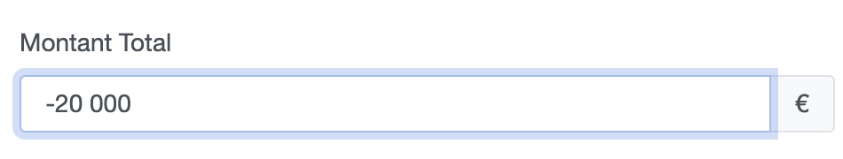

# Symfony UX Moneyspacer

Package Symfony UX qui permet d'ajouter des espaces comme séparateur de milliers à la saisie.

## Rendu final

Pour les nombres positifs


Pour les champs qui peuvent prendre des valeurs négatives :



## Installation

Dans votre composer.json, ajouter ce repo comme source de dépendance tel que:
```
"repositories": [
    {
        "type": "vcs",
        "url": "https://github.com/gbtux/symfony-ux-moneyspacer.git"
    }
]
```

Puis installer le package:

```
composer require symfony/ux-moneyspacer:dev-main
```

## Utilisation

Il y a 2 options à positionner pour un champs texte que vous voulez transformer en champs monétaire avec espace(s):
- l'option "spacer" pour les valeurs positives
- l'option "spacer_unsigned" pour les valeurs qui peuvent être négatives (avec conservation du signe moins)

Dans un classe de formulaire :

```
class FactureType extends AbstractType
{

    public function buildForm(FormBuilderInterface $builder, array $options): void
    {
        $builder
            ->add('montantTotal', TextType::class, [
                'label' => false,
                'required' => false,
                'spacer' => true
            ])
    }
```

ou avec l'option "spacer_unsigned":

```
class FactureType extends AbstractType
{

    public function buildForm(FormBuilderInterface $builder, array $options): void
    {
        $builder
            ->add('montantTotal', TextType::class, [
                'label' => false,
                'required' => false,
                'spacer_unsigned' => true
            ])
    }
```

Vous devez donc juste ajouter l'attribut "spacer"=>true ou "spacer_unsigned" => true à votre champs.
